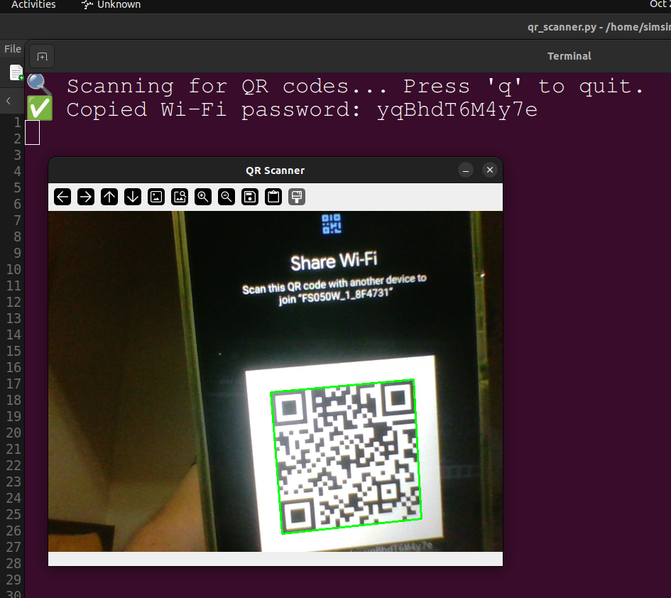
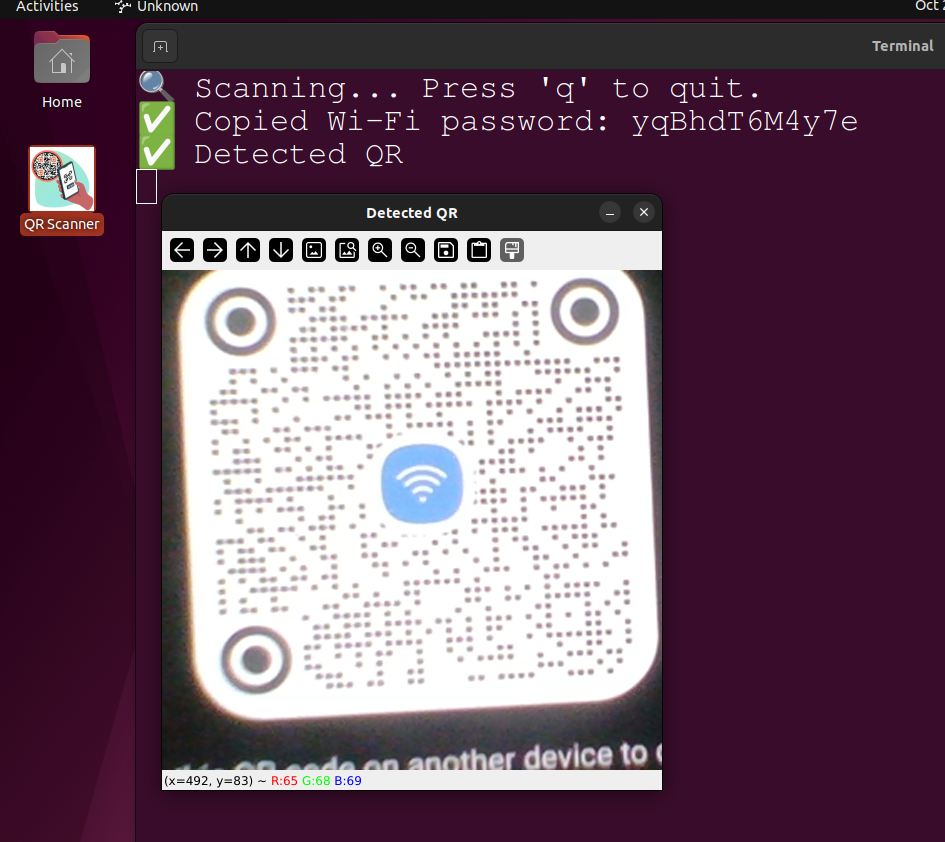

## 📘 QR Wi-Fi Scanner

This project provides a lightweight **desktop QR code scanner for wifi password** that detects Wi-Fi QR codes using webcam.
When a valid Wi-Fi sharing QR code is detected (on your phone or tablet select Wifi -> active network -> Share QR), it automatically copies the password to your clipboard.

<p align="center">
  
  
</p>


---

### ⚙️ Installation

1. **Install dependencies**

   ```bash
   git clone https://github.com/simsim314/QR-Wifi-Password.git
   pip install opencv-python pyperclip zxing-cpp
   cd QR-Wifi-Password
   bash make_qr_launcher.sh
   ```
   
### 🖥️ After Install

* You’ll find **QR Scanner.desktop** on your desktop.
* Double-click it anytime to start scanning.

---

### ▶️ Usage

1. Double-click the **QR Scanner** icon on your desktop.
2. A camera window will open.
3. Hold your phone or printed QR code up to the camera.
4. The password is automatically copied to your clipboard when detected.
6. Press **`q`** to quit, when the camera window open.

---

### ⚙️ Technical

The QR shared a string in the following frmat 

```
WIFI:S:HomeWiFi;T:WPA;P:mySecretPass;;
```

→ The app copies `mySecretPass` to clipboard.

